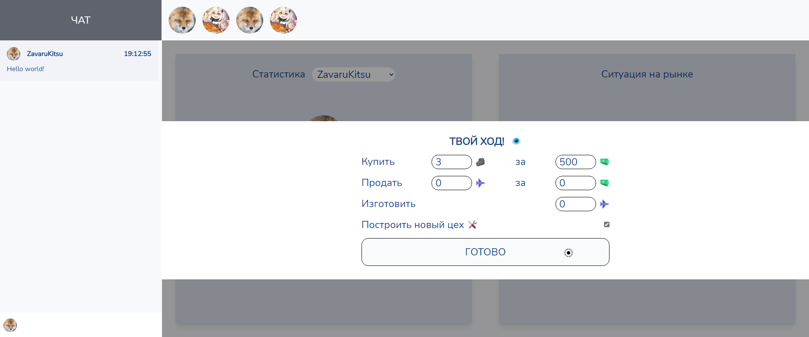
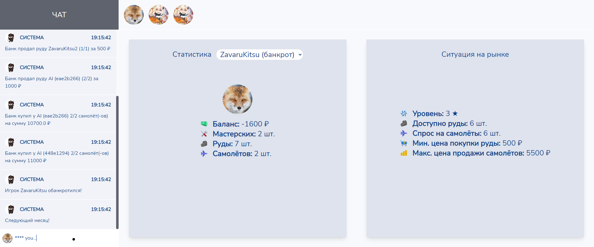

# Capitalists game






## Task

Create a game with backend.

## Features

- Live time (using **sockets.io**)
- Pretty designed
- Easy to play
- Has AI enemies (trained using **scikit-learn**)
- Scoreboards
- Can be dockerized

## How to run

```shell
git clone https://github.com/ZavaruKitsu/webgame
cd webgame

# setup virtual environment for backend
cd backend
python -m venv venv
pip install -r requirements.txt

# setup deps for frontend
cd ../frontend
yarn intall

# 1 terminal (run backend)
python main.py

# 2 terminal (run game)
yarn dev

# now open http://localhost:3000
```

## Project structure

> backend

Backend by itself, contains train data for AI and game essentials.

> frontend

Frontend written on Nuxt.TS 2.

> [Colab](https://datalore.jetbrains.com/view/notebook/ZFFpCJnDga9pra3ElXTCyG)

Colab for AI model training.

## Credits

- Icons8 for all `*.svg` files
